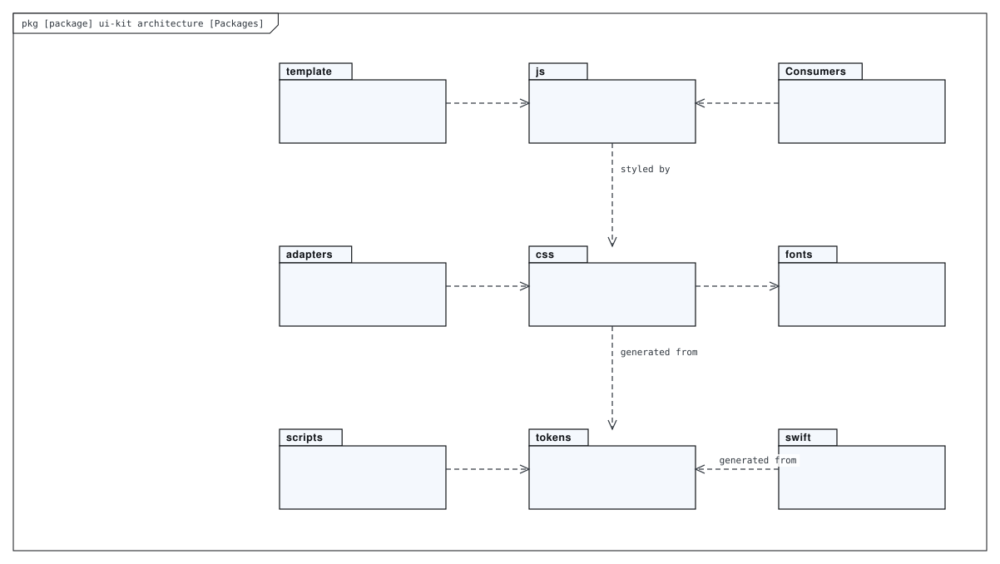
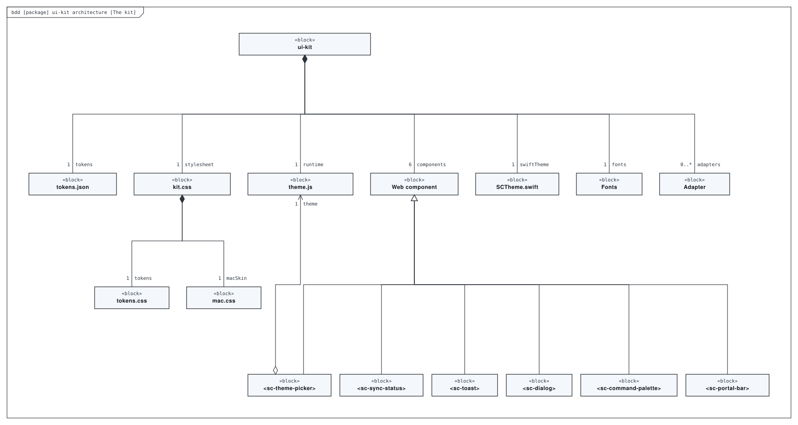
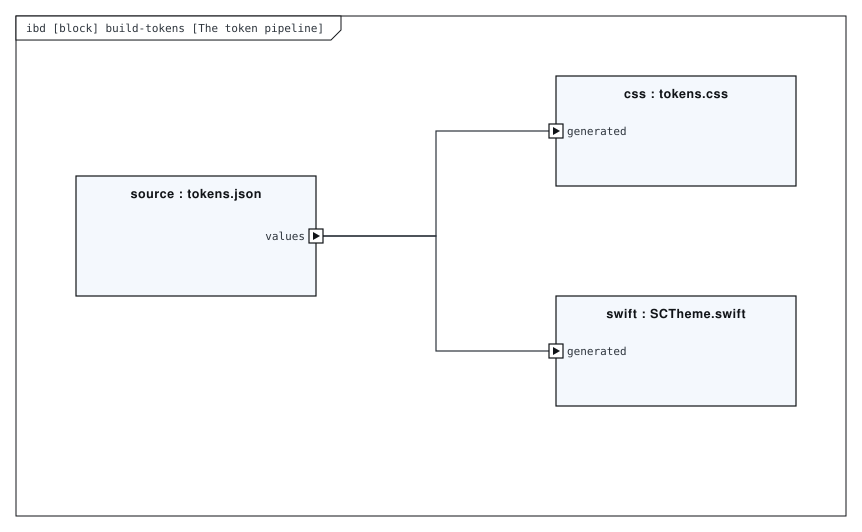
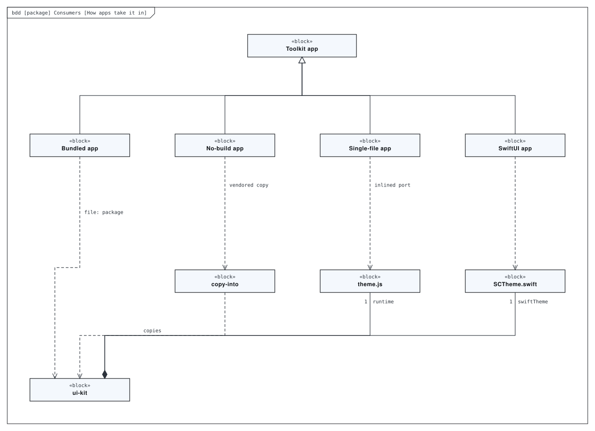
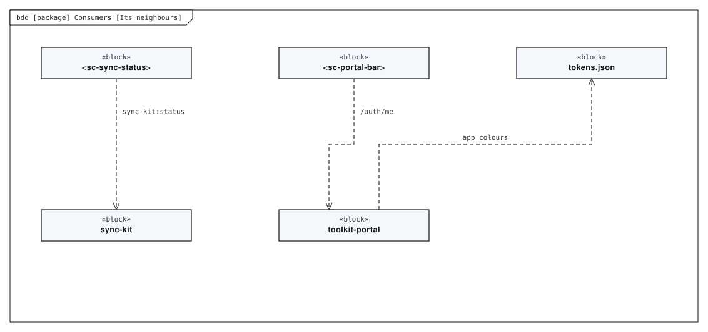
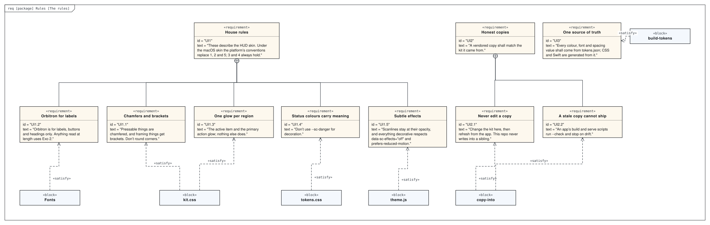

# Architecture

The toolkit’s one cross-framework UI layer. `tokens.json` is the single source; `build-tokens` generates the CSS custom properties and the SwiftUI theme from it; `theme.js` switches skin, palette and effects before first paint; six light-DOM web components give every app the same controls. Apps take it in one of four ways, depending on whether they have a build step.

This directory holds a SysML model of the repository, made with [SysML Modeler](https://github.com/allenxhsu/sysml-modeler).
`architecture.sysml.json` is the source: open it with **File ▸ Open** in the modeler to edit it, and re-export the SVGs from there.
The SVGs below are exports of it. The model passes the modeler's checks with 0 errors and 0 warnings.

## Packages

*Package diagram* of **ui-kit architecture**.

## The kit

*Block definition diagram* of **ui-kit architecture**.

## The token pipeline

*Internal block diagram* of **build-tokens**. scripts/build-tokens.mjs — regenerates css/tokens.css and swift/SCTheme.swift from tokens.json.

## How apps take it in

*Block definition diagram* of **Consumers**. The four ways an app takes the kit in.

## Its neighbours

*Block definition diagram* of **Consumers**. The four ways an app takes the kit in.

## The rules

*Requirement diagram* of **Rules**. README: the house rules, and the rules that keep vendored copies honest.

## Generated views

Computed from the model each time it is opened in the modeler:

- **The rules, as a table** — requirement table
- **What verifies which rule** — dependency matrix
